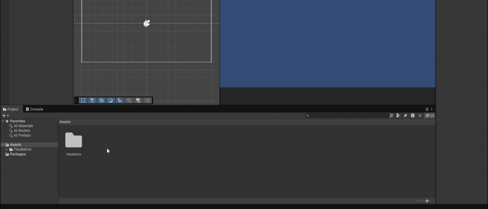

# Unity Folder Structure Generator

This repository contains a Unity Editor tool that automatically creates organized folder structures for Unity projects using configurable templates.

_Made and Tested with **Unity 6000.1.3f1**_

---

## Installation & Usage

### Quick Start

1.  Download or clone this repository.
2.  Copy the `FolderStructureGenerator` folder into your Unity project's `Assets/Editor/` directory.
3.  Open Unity and go to `Assets > Create Folders` in the menu bar.
4.  Enter your project name in the "Project Name" field.
5.  Select a configuration file (2D or 3D templates are included).
6.  Click "Generate Folders!" to create your folder structure.

### Creating Custom Configurations

1.  Right-click in your Project window.
2.  Go to `Create > Unity Tools > Folder Structure Config`.
3.  Name your configuration file.
4.  Customize the folder structure in the Inspector:
    - **Default Project Name**: The default name that appears in the generator.
    - **Folder Groups**: Main folders with their subfolders.
    - **Standalone Folders**: Independent folders created at the Assets root level.
    - **Create Git Keep Files**: Enable/disable `.gitkeep` file generation.

### [Built-in Templates for 2D/3D Games](docs/TEMPLATES.md)

---